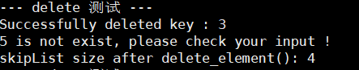

# 基于跳表实现的键值型存储引擎

## 1 项目说明

**Key-Value 存储引擎**  :sunflower:

基于 **跳表** 实现的 KV 存储引擎，使用 C++ 实现。在随机读写情况下，该项目每秒可处理请求数（QPS）：24.39 W，每秒可处理读请求数：18.41 W。（项目作者说明，但笔者测试不相同）

**提供接口** ：

:small_blue_diamond: insert_element  插入数据

:small_orange_diamond: delete_element 删除数据

:small_blue_diamond: search_element 查询数据

:small_orange_diamond: update_element 更新数据 （笔者添加）

:small_blue_diamond: display_list  打印跳跃表

:small_orange_diamond: dump_file  数据落盘

:small_blue_diamond: load_file 加载数据

:small_orange_diamond: size  返回数据规模

:small_blue_diamond: clear  清空跳表 （笔者添加）

----

## 2 项目测试

### 2.1 `skiplist.h` 测试

针对所有提供的 API 进行测试：

**测试结果** :star:

:small_blue_diamond: 插入操作：

:small_orange_diamond: 查找操作：

:small_blue_diamond: 更新操作：

:small_orange_diamond: 删除操作：

:small_blue_diamond: 数据落盘操作：

     

:small_orange_diamond: 打印跳表操作：

:small_blue_diamond: 清空跳表操作：

:small_orange_diamond: 数据加载操作：

:small_blue_diamond: 加载后的跳表：

**注意** :raising_hand_man:  ：

:one: 数据落盘只是存储了键值对；

:two: 数据加载是按照文件中的键值对重新进行 `insert`  操作;

:three: 数据加载后的跳表节点数和内容相同，但是层数和之间的关系可能变化。

-----

### 2.2  增删改查 QPS 测试

对增删改查进行测试。测试方法：设定固定的操作数，设置层高为 18，采用随机插入数据，看各个操作运行时间。

具体代码见：`stress-test/stress_test.cpp`

**运行设备** ：阿里云服务器 ECS 共享型 n4 (1核2G, 1 M 带宽)

**运行结果** ：

**结果统计** ：

| 具体操作\数据规模 |    10 w    |    50 w    |   100 w   |
| :---------------: | :--------: | :--------: | :-------: |
|       插入        | 0.099330 s | 0.840242 s | 2.09992 s |
|       删除        | 0.084905 s | 0.777721 s | 1.97519 s |
|       修改        | 0.106549 s | 0.971254 s | 2.42625 s |
|       查看        | 0.089328 s | 0.862964 s | 2.15155 s |

以 100 w 数据结果计算 QPS:

:small_blue_diamond: **插入** ：47.62 w :small_orange_diamond: **删除** ：50. 63 w :small_blue_diamond: **修改** ：41.22 w :small_orange_diamond: **查看** ：46.48 w

reference：

*1*：[Skiplist-CPP: A tiny KV storage based on skiplist written in C++ language ](https://github.com/youngyangyang04/Skiplist-CPP)

